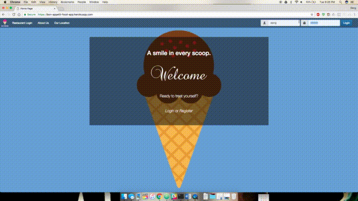
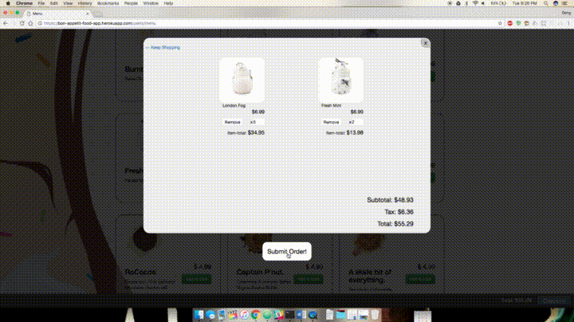
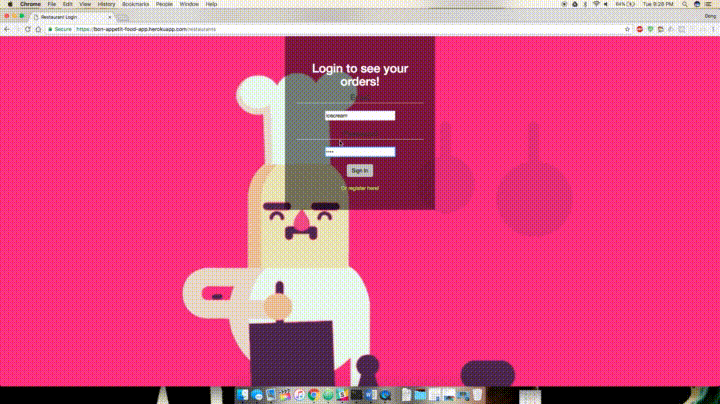

# Bon Appetit

A food pick-up ordering app built for an icecream parlor but scalable to include multiple restaurants as a midterm project at Lighthouse Labs with a team of 3. The app allows a customer(user) to place an order and a restaurant to notify the user the status of their order via a dynamic order status page and text message notification.

* Front-end built using HTML/CSS/SASS, Bootstrap, Javascript, AJAX
* Backend was built using Node.js, Express, and PostreSQL
* Twilio API (modern telecomm API service) was used to allow text message or audio communication between the customer and restaurant

# Demo
* https://bon-appetit-food-app.herokuapp.com/

```
Login with - username: dong - password: password
```

## Team Members
* Dong Hu
* Viktor Tymofeev
* Karunvir Singh

## Project Screenshots


```
Index Page for the user and restaurant to be able to login.
```
```
Menu and mini-cart allowing users to edit their order (increase, decrease or remove items).
```



```
Order confirmation page is displayed to the user once "Submit Order!" button is pressed. Twilio message is sent to customer's number.
```
```
User's active order page. They are able to see their order's estimated time of arrival (ETA), if their order has been completed and their order's details.
```



```
Restaurant's active order page that allows the restaurant to update the ETA and order completion status. Once 'done' is pressed, the order is removed from the restaurant's order page and user is notified by text message.
```

## Getting Started

1. Create the `.env` by using `.env.example` as a reference: `cp .env.example .env`
2. Update the .env file with your correct local information
3. Install dependencies: `npm i`
4. Fix to binaries for sass: `npm rebuild node-sass`
5. Run migrations: `npm run knex migrate:latest`
  * Check the migrations folder to see what gets created in the DB
6. Run the seed: `npm run knex seed:run`
  * Check the seeds file to see what gets seeded in the DB
7. Run the server: `npm run local`
8. Visit `http://localhost:8080/`

## Dependencies

* Node 5.10.x or above
* NPM 3.8.x or above
* async 2.4.1
* bcrypt 1.0.2
* body-parser 1.15.2
* cookie-session 2.0.0-beta.2
* dotenv 2.0.0
* ejs 2.4.1
* express 4.13.4
* knex 0.12.0
* knex-logger 0.1.0
* morgan 1.7.0
* ngrok 2.2.9
* node-sass-middleware 0.9.8
* nodemon 1.11.0
* pg 6.4.0
* stripe 4.22.0
* twilio 3.3.0

## Improvements
* Register Page for User
* User and restaurant authentication
* Responsive Design
